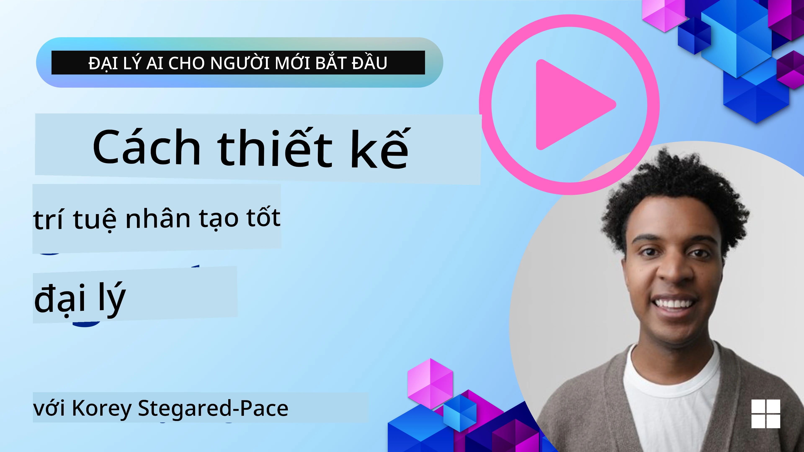
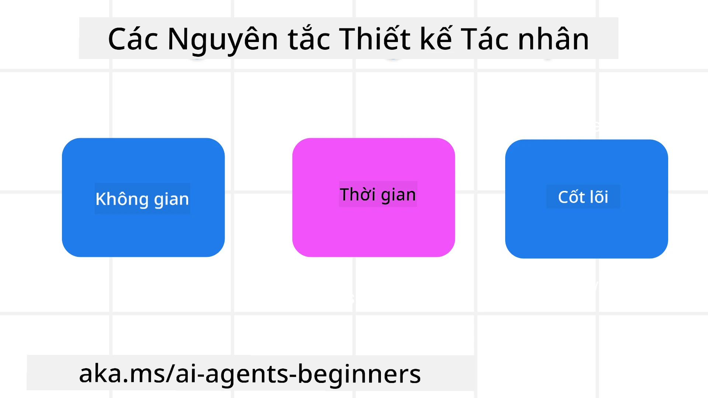

> _(Nhấp vào hình ảnh ở trên để xem video của bài học này)_
# Nguyên tắc thiết kế Agent AI

## Giới thiệu

Có nhiều cách để suy nghĩ về việc xây dựng các Hệ thống Agent AI. Do sự mơ hồ là một tính năng chứ không phải lỗi trong thiết kế Generative AI, đôi khi các kỹ sư khó biết phải bắt đầu từ đâu. Chúng tôi đã tạo ra một bộ Nguyên tắc Thiết kế UX lấy con người làm trung tâm để giúp các nhà phát triển xây dựng các hệ thống Agent hướng tới khách hàng nhằm giải quyết nhu cầu kinh doanh của họ. Những nguyên tắc thiết kế này không phải là một kiến trúc chỉ định bắt buộc mà là một điểm khởi đầu cho các nhóm đang xác định và phát triển trải nghiệm Agent.

Nói chung, các Agent nên:

- Mở rộng và nâng cao năng lực con người (động não, giải quyết vấn đề, tự động hóa, v.v.)
- Lấp đầy khoảng trống kiến thức (giúp tôi nắm bắt nhanh các lĩnh vực kiến thức, dịch thuật, v.v.)
- Tạo điều kiện và hỗ trợ hợp tác theo cách mà mỗi chúng ta ưu tiên khi làm việc với người khác
- Giúp chúng ta trở nên phiên bản tốt hơn của chính mình (ví dụ: huấn luyện cuộc sống/định hướng nhiệm vụ, giúp chúng ta học các kỹ năng điều chỉnh cảm xúc và chánh niệm, xây dựng khả năng phục hồi, v.v.)

## Bài học này sẽ bao gồm

- Các Nguyên tắc Thiết kế Hệ thống Agent là gì
- Một số hướng dẫn cần tuân theo khi triển khai các nguyên tắc thiết kế này
- Một số ví dụ về việc sử dụng các nguyên tắc thiết kế

## Mục tiêu học tập

Sau khi hoàn thành bài học này, bạn sẽ có thể:

1. Giải thích các Nguyên tắc Thiết kế Hệ thống Agent là gì
2. Giải thích các hướng dẫn khi sử dụng các Nguyên tắc Thiết kế Hệ thống Agent
3. Hiểu cách xây dựng một Agent sử dụng các Nguyên tắc Thiết kế Hệ thống Agent

---

## 🛠 Thực hành Xuyên suốt Khóa học (Web Agent)

> [!TIP]
> **Nhìn vào Code Thực Tế: Pattern nào đang được sử dụng?**  
> Trong dự án `my-practice/web-agent/`, nếu bạn mở file `main.py`, bạn sẽ thấy chúng ta đang áp dụng **Routing Pattern (Mẫu Định tuyến)** kết hợp với **Orchestrator-Worker**. 
> - **Orchestrator:** Hàm `execute_sub_agent` đóng vai trò là não bộ trung tâm.
> - **Workers (Sub-agents):** Các skills nằm trong thư mục `skills/` (như `weather`, `search`).
> 
> Đây là minh chứng rõ ràng nhất cho nguyên tắc: *Tách biệt trách nhiệm để Agent làm việc hiệu quả và chính xác hơn.*

---

## Nguyên tắc thiết kế hệ thống Agent

### Agent (Không gian)

Đây là môi trường mà Agent hoạt động. Những nguyên tắc này hướng dẫn cách chúng ta thiết kế các Agent để tương tác trong thế giới vật lý và kỹ thuật số.

- **Kết nối, không thay thế** – giúp kết nối con người với nhau, sự kiện và kiến thức có thể hành động để tạo điều kiện cho hợp tác và kết nối.
- Các Agent giúp kết nối sự kiện, kiến thức và con người.
- Các Agent đưa con người xích lại gần nhau hơn. Chúng không được thiết kế để thay thế hay hạ thấp con người.
- **Dễ tiếp cận nhưng thỉnh thoảng vô hình** – Agent chủ yếu hoạt động ở hậu trường và chỉ nhắc nhở chúng ta khi có liên quan và phù hợp.
  - Agent dễ dàng được phát hiện và truy cập cho người dùng được ủy quyền trên mọi thiết bị hoặc nền tảng.
  - Agent hỗ trợ đầu vào và đầu ra đa phương thức (âm thanh, giọng nói, văn bản, v.v.).
  - Agent có thể chuyển đổi liền mạch giữa nền trước và nền sau; giữa chủ động và phản ứng, tùy theo việc cảm nhận nhu cầu của người dùng.
  - Agent có thể hoạt động ở dạng vô hình, nhưng đường dẫn quy trình nền và sự hợp tác với các Agent khác vẫn minh bạch và có thể được người dùng kiểm soát.

### Agent (Thời gian)

Đây là cách Agent hoạt động theo thời gian. Những nguyên tắc này chỉ dẫn cách chúng ta thiết kế các Agent tương tác xuyên qua quá khứ, hiện tại và tương lai.

- **Quá khứ**: Phản ánh lịch sử bao gồm cả trạng thái và bối cảnh.
  - Agent cung cấp kết quả phù hợp hơn dựa trên phân tích dữ liệu lịch sử phong phú hơn, không chỉ riêng sự kiện, con người hoặc trạng thái.
  - Agent tạo kết nối từ các sự kiện trong quá khứ và tích cực phản chiếu bộ nhớ để tương tác với các tình huống hiện tại.
- **Hiện tại**: Gợi ý nhiều hơn là chỉ thông báo.
  - Agent thể hiện một phương pháp toàn diện để tương tác với con người. Khi một sự kiện xảy ra, Agent vượt ra ngoài các thông báo tĩnh hay các hình thức tĩnh khác. Agent có thể đơn giản hóa luồng công việc hoặc tạo các gợi ý động để hướng sự chú ý của người dùng vào đúng thời điểm.
  - Agent cung cấp thông tin dựa trên bối cảnh môi trường, những thay đổi xã hội và văn hóa và được điều chỉnh theo ý định của người dùng.
  - Tương tác với Agent có thể diễn ra dần dần, phát triển/tăng độ phức tạp để trao quyền cho người dùng về lâu dài.
- **Tương lai**: Thích nghi và phát triển.
  - Agent thích nghi với nhiều thiết bị, nền tảng và phương thức.
  - Agent thích nghi với hành vi người dùng, nhu cầu truy cập và có thể tùy chỉnh một cách tự do.
  - Agent được định hình và tiến hóa thông qua sự tương tác liên tục với người dùng.

### Agent (Cốt lõi)

Đây là các yếu tố chính trong lõi thiết kế của một Agent.

- **Chấp nhận sự không chắc chắn nhưng thiết lập niềm tin**.
  - Một mức độ không chắc chắn của Agent là điều được mong đợi. Sự không chắc chắn là một yếu tố then chốt trong thiết kế Agent.
  - Niềm tin và tính minh bạch là các lớp nền tảng của thiết kế Agent.
  - Con người kiểm soát khi nào Agent bật/tắt và trạng thái của Agent phải được hiển thị rõ ràng mọi lúc.

## Hướng dẫn triển khai các nguyên tắc này

Khi bạn sử dụng những nguyên tắc thiết kế ở trên, hãy áp dụng các hướng dẫn sau:

1. **Minh bạch**: Thông báo cho người dùng rằng có AI tham gia, cách nó hoạt động (bao gồm các hành động trong quá khứ), và cách gửi phản hồi cũng như chỉnh sửa hệ thống.
2. **Kiểm soát**: Cho phép người dùng tuỳ chỉnh, chỉ định sở thích và cá nhân hóa, và kiểm soát hệ thống cùng các thuộc tính của nó (bao gồm khả năng quên).
3. **Nhất quán**: Hướng tới trải nghiệm nhất quán, đa phương thức trên các thiết bị và điểm cuối. Sử dụng các yếu tố UI/UX quen thuộc khi có thể (ví dụ: biểu tượng micro cho tương tác bằng giọng nói) và giảm tải nhận thức cho khách hàng tối đa có thể (ví dụ: hướng tới phản hồi ngắn gọn, trợ giúp bằng hình ảnh và nội dung ‘Tìm hiểu thêm’).

## Cách Thiết kế một Agent Du lịch theo Các Nguyên tắc và Hướng dẫn này

Giả sử bạn đang thiết kế một Agent Du lịch, dưới đây là cách bạn có thể cân nhắc sử dụng các Nguyên tắc và Hướng dẫn Thiết kế:

1. **Minh bạch** – Cho người dùng biết rằng Agent Du lịch được hỗ trợ bởi AI. Cung cấp một vài hướng dẫn cơ bản về cách bắt đầu (ví dụ: một thông điệp “Xin chào”, các prompt mẫu). Ghi rõ điều này trên trang sản phẩm. Hiển thị danh sách các prompt mà người dùng đã hỏi trong quá khứ. Làm rõ cách gửi phản hồi (biểu tượng thích/không thích, nút Gửi phản hồi, v.v.). Nói rõ nếu Agent có giới hạn về sử dụng hoặc chủ đề.
2. **Kiểm soát** – Đảm bảo rõ ràng cách người dùng có thể chỉnh sửa Agent sau khi nó được tạo với những thứ như System Prompt. Cho phép người dùng chọn mức độ chi tiết của Agent, phong cách viết, và bất kỳ lưu ý nào về những chủ đề Agent không nên bàn luận. Cho phép người dùng xem và xóa bất kỳ tệp hoặc dữ liệu liên quan, các prompt, và các cuộc trò chuyện trong quá khứ.
3. **Nhất quán** – Đảm bảo các biểu tượng cho Chia sẻ Prompt, thêm tệp hoặc ảnh và gắn thẻ ai đó hoặc điều gì đó là tiêu chuẩn và dễ nhận biết. Sử dụng biểu tượng kẹp giấy để chỉ việc tải lên/chia sẻ tệp với Agent, và biểu tượng hình ảnh để chỉ việc tải lên đồ họa.

## Mã mẫu

- Python: [Agent Framework](./code_samples/03-python-agent-framework.ipynb)
- .NET: [Agent Framework](./code_samples/03-dotnet-agent-framework.md)

## Bạn còn câu hỏi nào về các Mẫu thiết kế Agent AI không?

Tham gia the [Microsoft Foundry Discord](https://aka.ms/ai-agents/discord) để gặp gỡ các người học khác, tham dự giờ làm việc và được giải đáp các câu hỏi về Agent AI của bạn.

## Tài nguyên bổ sung

- <a href="https://openai.com" target="_blank">Thực hành quản trị Hệ thống Agent AI | OpenAI</a>
- <a href="https://microsoft.com" target="_blank">Dự án HAX Toolkit - Microsoft Research</a>
- <a href="https://responsibleaitoolbox.ai" target="_blank">Hộp công cụ AI có trách nhiệm</a>

## Bài học trước

[Khám phá các Agentic Frameworks](../03-explore-agentic-frameworks/README.md)

## Bài học tiếp theo

[Mẫu thiết kế sử dụng Tool (Tool-Use)](../05-tool-use/README.md)

---

<!-- CO-OP TRANSLATOR DISCLAIMER START -->
**Miễn trừ trách nhiệm**:
Tài liệu này đã được dịch bằng dịch vụ dịch thuật AI [Co-op Translator](https://github.com/Azure/co-op-translator). Mặc dù chúng tôi nỗ lực đảm bảo độ chính xác, xin lưu ý rằng bản dịch tự động có thể chứa sai sót hoặc không chính xác. Văn bản gốc bằng ngôn ngữ gốc nên được coi là nguồn tham chiếu chính thức. Đối với những thông tin quan trọng, khuyến nghị sử dụng bản dịch chuyên nghiệp do người dịch thực hiện. Chúng tôi không chịu trách nhiệm cho bất kỳ sự hiểu nhầm hay giải thích sai nào phát sinh từ việc sử dụng bản dịch này.
<!-- CO-OP TRANSLATOR DISCLAIMER END -->