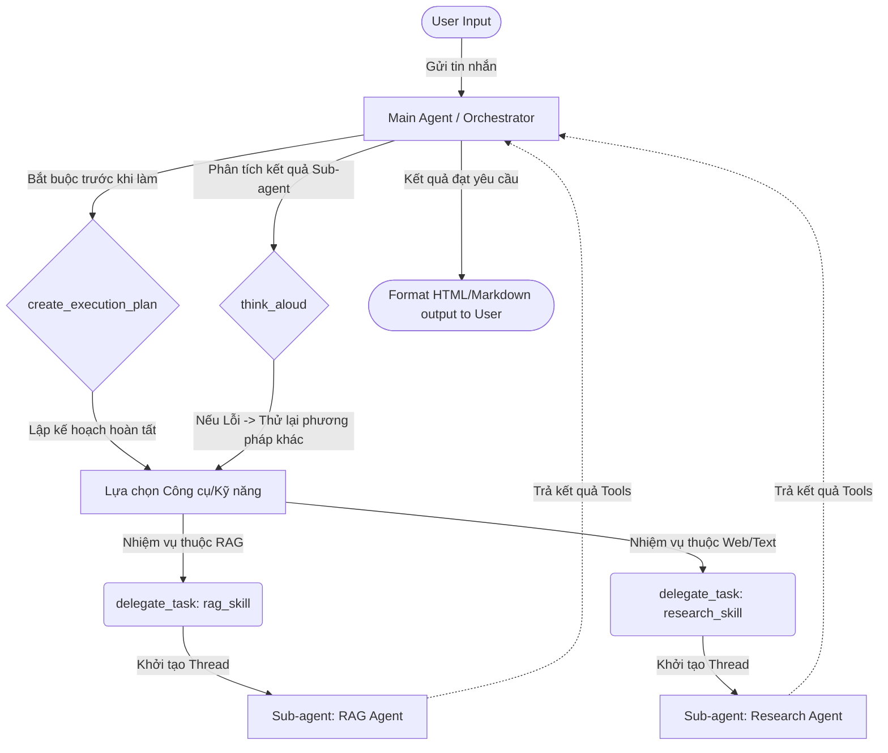

# 🏗️ Kiến Trúc Hệ Thống Web Agent (AI Agents for Beginners)

Tài liệu này mô tả chi tiết kiến trúc của ứng dụng **Web Agent Local** thuộc chương trình đào tạo *AI Agents for Beginners*. Hệ thống được thiết kế theo mô hình **Hierarchical Orchestration** (Điều phối phân tầng) và tuân thủ nguyên tắc minh bạch hệ thống (System Transparency).

---

## 1. 🤖 Danh sách Agent & Sub-agent

Hệ thống hoạt động với một Agent chủ quản lý vòng lặp sự kiện và điều phối nhiều Sub-agent con chuyên trách:

| Vai trò | Agent Name | Vị trí / Tệp tin | Chức năng chính |
| :--- | :--- | :--- | :--- |
| **Quản đốc (Orchestrator)** | Main Agent | `main.py` | Lắng nghe người dùng, phân tích yêu cầu, lên kế hoạch (Planning), và phân phối công việc cho các Sub-agent tương ứng. |
| **Thợ chuyên trách (Worker)** | Core Agent | `skills/core_skill.py` | Xử lý tính toán toán học, mã hóa Python và tương tác hệ thống tệp. |
| **Thợ chuyên trách (Worker)** | RAG Agent | `skills/rag_skill.py` | Chuyên gia truy vấn Cơ sở dữ liệu Vector (ChromaDB). |
| **Thợ chuyên trách (Worker)** | Research Agent | `skills/research_skill.py` | Khai thác thông tin trên Internet, quét Web và kho tài liệu nội bộ (text). |
| **Thợ chuyên trách (Worker)** | Memory Agent | `skills/memory_skill.py` | Quản lý lưu trữ bộ nhớ (dài hạn/ngắn hạn) cho Agent. |
| **Thợ chuyên trách (Worker)** | SQL Agent | `skills/sql_skill.py` | Tương tác, truy vấn và trích xuất dữ liệu từ các CSDL có cấu trúc (SQLite/MySQL). |
| **Thợ chuyên trách (Worker)** | Weather Agent | `skills/weather_skill.py` | Kết nối API thời tiết thời gian thực. |

---

## 2. 🧩 Danh sách Kỹ năng (Skills)

Kỹ năng (Skill) là một tập hợp các Lệnh (Prompts) đóng gói cùng với các Công cụ (Tools) chuyên biệt. Khi Main Agent gọi một Skill, nó thực chất đang khởi tạo một Sub-agent với tính cách và năng lực riêng.

1. **Orchestrator Skills:** Kỹ năng tự quản lý của Main Agent.
2. **RAG Skill:** Tìm kiếm ngữ nghĩa (Semantic search) trên CSDL Vector.
3. **Research Skill:** Nghiên cứu mở rộng thông qua quét dữ liệu Text và Web.
4. **Core Skill:** Kỹ năng điện toán cốt lõi.
5. **Memory Skill:** Kỹ năng ghi nhớ và triệu hồi trí nhớ.
6. **SQL Skill:** Kỹ năng phân tích Data bảng.
7. **Weather Skill:** Kỹ năng ngoại vi (gọi API).

---

## 3. 🛠️ Danh sách Công cụ (Tools)

Dưới đây là bảng ánh xạ toàn bộ các Công cụ mà hệ thống Agent có khả năng tự động thực thi (Function Calling). Mọi công cụ đều được khai báo chặt chẽ bằng `SCHEMAS` (FunctionDeclaration).

| Nguồn cung cấp (Skill) | Công cụ (Tool Name) | Mô tả chức năng |
| :--- | :--- | :--- |
| **Orchestrator** | `delegate_task` | Giao việc cho Sub-agent kèm bối cảnh (Context). |
| **Orchestrator** | `create_execution_plan` | Lập kế hoạch từng bước trước khi hành động. |
| **Orchestrator** | `think_aloud` | Tự suy ngẫm (Metacognition) để đánh giá lỗi. |
| **RAG Skill** | `search_vector_database` | Tìm kiếm dữ liệu từ ChromaDB thông qua Embeddings. |
| **Research Skill** | `search_knowledge_base` | Truy vấn từ điển tĩnh nội bộ. |
| **Research Skill** | `read_company_document` | Đọc toàn văn (full-text) file tài liệu văn bản. |
| **Research Skill** | `read_webpage_content` | Crawler: Cào văn bản thuần túy từ URL được cung cấp. |
| **Research Skill** | `ask_researcher_agent` | Handoff công việc suy luận sâu cho một LLM khác đánh giá. |
| **Core Skill** | `calculate_expression` | Giải toán chính xác. |
| **Core Skill** | `run_python_code` | Thực thi mã máy chủ (Sandboxed Python). |
| **Core Skill** | `read_file` / `list_directory` | Đọc hệ thống tệp tin máy chủ. |
| **Memory Skill** | `save_to_memory` / `retrieve_from_memory` | Ghi/đọc lịch sử người dùng. |
| **SQL Skill** | `execute_sql_query` / `list_tables` | Truy vấn trực tiếp CSDL. |
| **Weather Skill** | `get_current_weather` / `get_weather_forecast` | Fetch thông tin API bên ngoài. |

---

## 4. 📚 Thư viện Tri thức (Knowledge Base)

Dữ liệu để Agent học hỏi và phản hồi người dùng được tổ chức thành 3 cấp độ:

1. **Vector Database (ChromaDB):**
   - **Vị trí:** `data/chroma_db`
   - **Cơ chế:** Lưu trữ dưới dạng Embeddings trong collection `sconnect_knowledge`. Sử dụng thuật toán KNN (K-Nearest Neighbors) để tìm kiếm theo ý nghĩa câu hỏi.
2. **Text-based Documents (Tài liệu thô):**
   - **Vị trí:** `data/sconnect_knowledge.txt` và file `knowledge_base.txt`.
   - **Cơ chế:** Cung cấp nguồn dữ liệu thô cho quá trình RAG hoặc khi Research Agent sử dụng công cụ đọc Full-text nội bộ.
3. **Hard-coded KB (Từ điển nhúng):**
   - **Vị trí:** Bên trong file mã nguồn `skills/research_skill.py`.
   - **Cơ chế:** Tra cứu từ khóa O(1) tốc độ cao cho các định nghĩa cố định.

---

## 5. 🚦 Bộ định tuyến (Orchestrator Router Flow)

Cách Main Agent kiểm soát và phân phối lưu lượng tác vụ (Traffic Control).

**Nguyên lý bảo mật & Toàn vẹn:**
Main Agent **không bao giờ** tự mình đi cào web hay đọc file. Toàn bộ hành động phải được ủy quyền thông qua cổng `delegate_task`. Điều này cho phép thiết lập hệ thống chấm điểm (Evaluator) hoặc giới hạn quyền hạn (Sandboxing) ở cấp độ Worker một cách an toàn.
